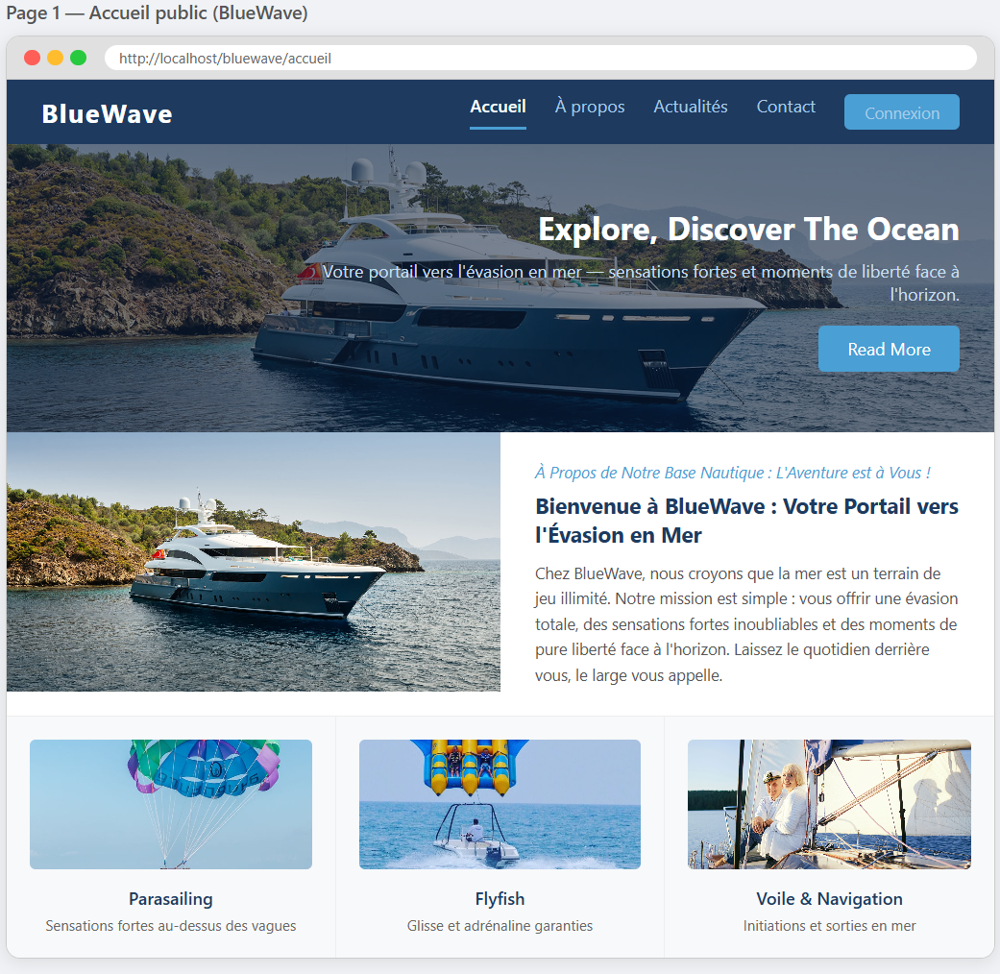
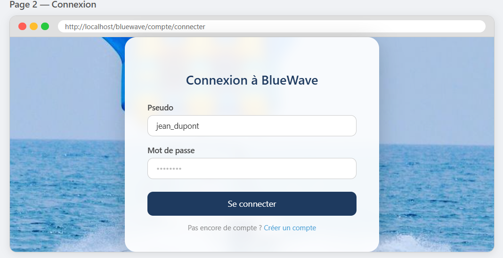
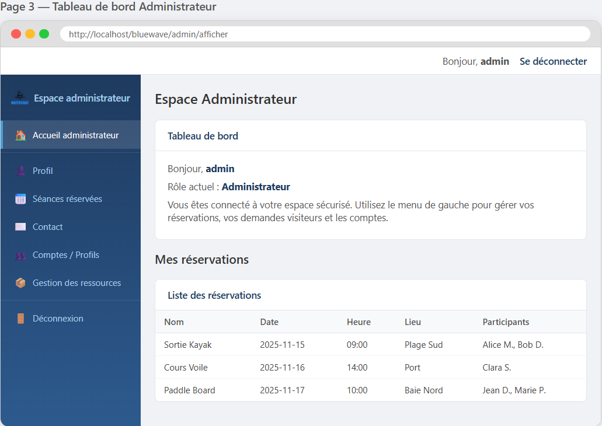
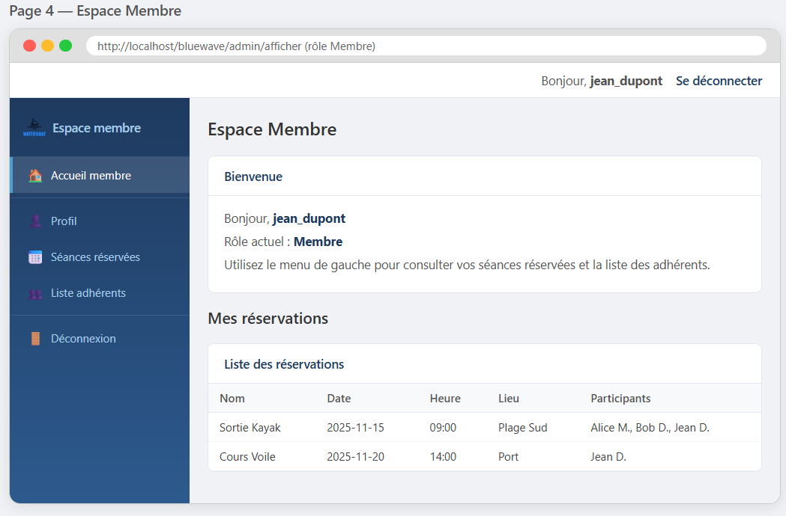

# 🌊 BlueWave — Application de gestion de base nautique

Application web complète développée en **CodeIgniter 4** (PHP MVC) pour la gestion d'une base nautique : réservations de séances, gestion des membres, messagerie, actualités et administration.

---

## 📸 Aperçu de l'application

### Page d'accueil publique


### Connexion / Inscription


### Tableau de bord Admin


### Espace Membre


---

## 🛠️ Technologies utilisées

| Technologie | Usage |
|-------------|-------|
| PHP 8+ | Langage principal |
| CodeIgniter 4 | Framework MVC |
| MySQL / SQL | Base de données relationnelle |
| HTML5 / CSS3 | Structure et styles |
| JavaScript | Interactions côté client |
| Bootstrap 4 | Interface responsive (public) |
| SB Admin 2 | Dashboard admin |
| Sessions CI4 | Authentification et gestion des rôles |

---

## 🏗️ Architecture MVC

```
app/
├── Controllers/
│   ├── Accueil.php          # Page d'accueil publique
│   ├── Compte.php           # Inscription, connexion, déconnexion
│   ├── Admin.php            # Tableau de bord admin & membre
│   ├── Reservation.php      # Gestion des réservations
│   ├── Demande.php          # Demandes de réservation
│   ├── Message.php          # Messagerie membre ↔ admin
│   ├── Actualite.php        # Gestion des actualités
│   ├── Visiteur.php         # Gestion des visiteurs
│   └── Apropos.php          # Page à propos
├── Models/
│   └── Db_model.php         # Modèle unique centralisé (toutes les requêtes SQL)
├── Views/
│   ├── templates/           # Header/footer public et admin
│   ├── admin/               # Vues réservées à l'admin
│   ├── connexion/           # Pages login/profil
│   ├── compte/              # Création de compte
│   └── membre/              # Espace membre
public/
├── bootstrap/               # Thème public (Bootstrap nautique)
└── bootstrap2/              # Thème admin (SB Admin 2)
```

---

## 👥 Rôles utilisateurs

| Rôle | Code | Accès |
|------|------|-------|
| Administrateur | `A` | Tout — gestion des séances, réservations, comptes, messages |
| Membre | `M` | Ses réservations, demandes, profil, messages |
| Invité | `I` | Accueil public, inscription |

---

## ✅ Fonctionnalités

### Espace public
- Page d'accueil avec présentation des activités (voile, kayak, surf...)
- Page "À propos" de la base nautique
- Affichage des actualités
- Formulaire de contact / message
- Inscription et connexion sécurisée (validation CI4)

### Espace Membre
- Voir ses réservations avec liste des participants
- Faire une demande de réservation
- Messagerie avec l'administration
- Consultation du profil

### Espace Administrateur
- Tableau de bord avec statistiques (nombre de membres, réservations)
- Gestion des séances : créer, lister, filtrer par date
- Gestion des réservations : liste complète avec participants
- Gestion des comptes membres (liste, fonction SQL de comptage)
- Modération des messages et réponse aux membres
- Gestion des actualités
- Gestion des ressources nautiques

---

## 🗄️ Base de données

Le fichier SQL de création de la base est fourni : `e22307604_db1(3).sql`

Tables principales : comptes, réservations, séances, ressources, messages, actualités, participants.

---

## 🚀 Installation

### Prérequis
- PHP 8.0+
- MySQL 5.7+
- Serveur web (Apache / Nginx) ou PHP built-in server
- Composer

### Étapes

```bash
# 1. Cloner le repo
git clone https://github.com/abdallah-76/base-nautique.git
cd base-nautique/V2/ci

# 2. Installer les dépendances
composer install

# 3. Configurer l'environnement
cp .env.example .env
# Modifier .env : base_url, DB_HOST, DB_DATABASE, DB_USERNAME, DB_PASSWORD

# 4. Importer la base de données
mysql -u root -p < ../../e22307604_db1\(3\).sql

# 5. Lancer le serveur
php spark serve
```

L'application est accessible à `http://localhost:8080`

---

## 📁 Structure des fichiers importants

```
├── V2/ci/
│   ├── app/              → Code source (Controllers, Models, Views)
│   ├── public/           → Fichiers publics (CSS, JS, images)
│   ├── .env              → Configuration locale (ne pas commiter)
│   └── composer.json     → Dépendances PHP
└── e22307604_db1(3).sql  → Script SQL de la base de données
```

---

## 👨‍💻 Auteur

**Abdallah Maammar**
- 🌐 [Portfolio](https://abdallah-76.github.io)
- 💼 [LinkedIn](https://www.linkedin.com/in/abdallah-maammar-930860326/)
- 🔗 [GitHub](https://github.com/abdallah-76)

---

## 📄 Licence

Projet académique — Université de Bretagne Occidentale (UBO) · Licence Informatique L3
